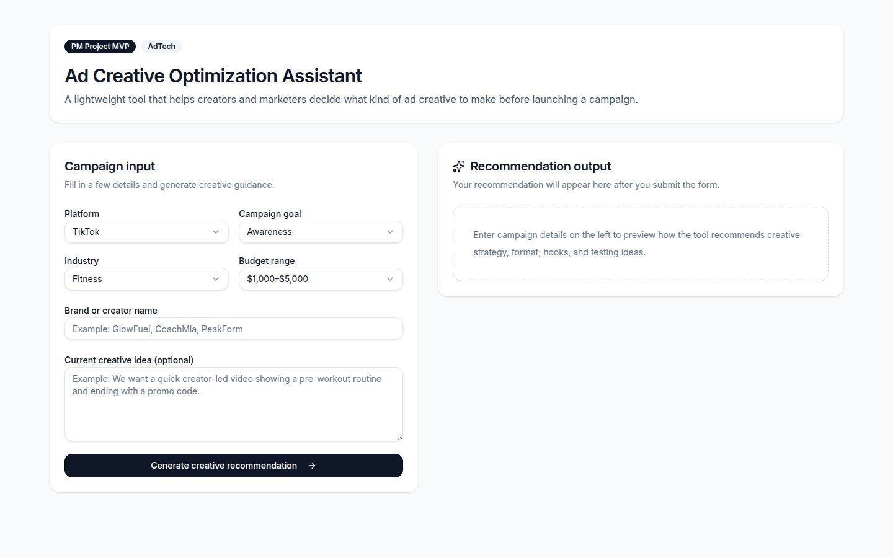
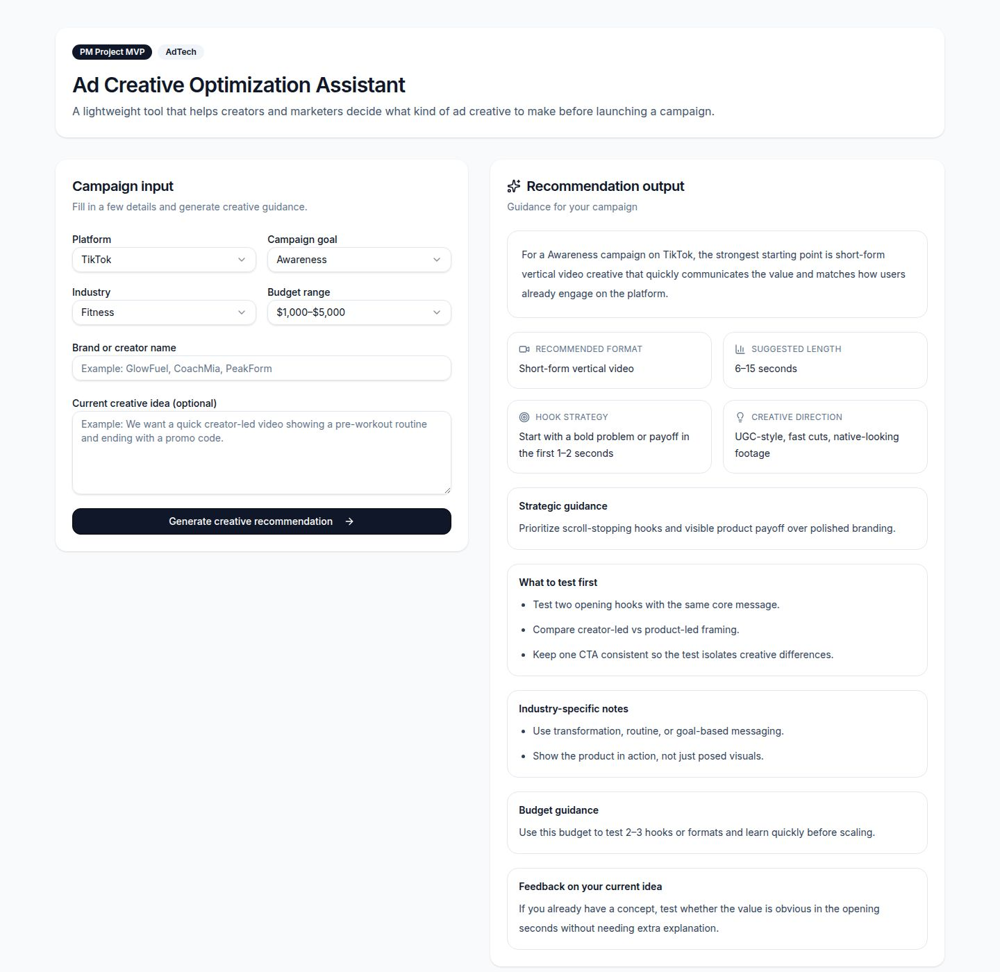

# HookPilot

AI-powered ad creative ideation tool built for performance marketers.

HookPilot generates high-performing ad hooks using structured prompt logic, proven marketing frameworks, and real-world campaign insights.

## The Problem

In performance marketing, creative fatigue is one of the biggest drivers of declining performance.

Teams consistently face challenges in:
- Generating fresh, high-converting hooks
- Scaling creative testing efficiently
- Translating campaign insights into new iterations
- Maintaining performance across platforms such as TikTok, YouTube, and Meta

Despite significant investment in media, creative development remains manual, inconsistent, and difficult to scale.

## Early Observations

Initial feedback suggests that users:
- Struggle to decide what type of creative to produce before launching campaigns
- Rely heavily on guesswork or competitor inspiration
- Want clearer guidance on platform-specific best practices

## The Solution

HookPilot streamlines and automates the ideation process by combining:
- AI-generated outputs
- Performance marketing frameworks
- Structured prompt logic

Users input campaign details, and HookPilot generates multiple high-quality hooks designed to drive engagement and conversions.

## How It Works

1. User inputs:
   - Product or brand
   - Target audience
   - Platform (e.g., TikTok, YouTube)
   - Campaign objective

2. The system processes inputs through:
   - Pre-defined marketing frameworks
   - Prompt engineering logic
   - AI generation

3. Outputs include:
   - Multiple ad hook variations
   - Platform-specific messaging angles
   - Concepts designed for A/B testing

## Key Features

- Performance-driven hook generation
- Designed for scalable A/B testing
- Platform-specific outputs
- Framework-backed logic (not generic AI output)
- Rapid iteration for creative development

## Product Thinking

HookPilot was designed to solve a gap in how marketers approach creative strategy.

Most tools optimize campaigns after launch, but very few help users decide what creative to produce before spending budget.

This product focuses on:
- Pre-launch decision support
- Platform-specific creative strategy
- Simplifying complex ad decisions into actionable recommendations

## Tradeoffs

- Prioritized speed to MVP over deep AI integration
- Used rule-based logic instead of real-time performance data
- Limited inputs to reduce user friction and improve usability

## Product Roadmap & Vision

**V1 (Current – MVP)**
- Rule-based creative recommendation engine
- Structured input-to-output experience
- Platform-specific guidance (TikTok, YouTube, Pinterest)
- Working live product

Goal: Validate whether users find pre-launch creative guidance useful.

**V2 (Next Iteration – AI Enhancement)**
- AI-powered recommendations using OpenAI API
- Dynamic hook and messaging generation
- More personalized outputs based on user inputs

Goal: Improve recommendation quality and make outputs more actionable and tailored.

**V3 (Future Vision – Performance Layer)**
- Creative scoring system
- Ability to input or upload ad concepts for feedback
- Performance-informed recommendations based on trends

Goal: Move from static guidance → intelligent, feedback-driven optimization.

**V4 (Long-Term Vision – Platform Integration)**
- Integration with ad platforms (TikTok Ads, Google Ads)
- Real-time performance feedback loops
- Automated creative optimization suggestions

Goal: Close the loop between creative strategy and actual campaign performance.

## AI Integration (Planned)

HookPilot is designed to evolve into an AI-powered creative recommendation engine.

The next iteration (V2) will introduce:
- Dynamic recommendations using OpenAI API
- Context-aware creative strategy generation
- More personalized outputs based on campaign inputs

Architecture approach:
- Frontend (React) will send campaign inputs to a backend endpoint
- Backend will securely call the OpenAI API
- Responses will be structured and returned to the UI

Note: API keys will be stored securely server-side and not exposed to the client.

## Example Use Case

Input:
- Product: Fitness app
- Audience: Busy professionals
- Platform: TikTok

Output:
- “No time to work out? This 10-minute hack is changing everything.”
- “I tried the ‘lazy workout’ trend for 7 days. Here’s what happened.”
- “POV: You finally found a workout that fits your schedule.”

## Live Demo

Try HookPilot here:
https://hook-pilot--dcloyd11.replit.app

No login required. Enter campaign details to generate creative recommendations.

## Preview

A lightweight AdTech product that helps marketers and creators decide what kind of ad creative to build before launching a campaign.  
Users input campaign details and receive platform-specific creative recommendations, including format, hooks, and testing strategy.

### Input Experience

### Recommendation Output

## Tech Stack

- Frontend: React (JavaScript, JSX)
- Styling: Tailwind CSS + component-based UI
- Hosting & Deployment: Replit
- Version Control: GitHub

Future Enhancements:
- AI Integration: OpenAI API (planned for V2)

## About

Built by Dorian C.

USC Marshall MBA and Product & Growth Strategist with a background in performance marketing and ad technology.

Experience includes:
- Leading $40M+ in programmatic media investment across full-funnel campaigns
- Driving ~50% improvements in campaign efficiency through data-driven optimization and testing frameworks
- Building scalable campaign structures, measurement systems, and cross-functional workflows across creative, analytics, and engineering teams

HookPilot is an extension of this experience — translating real-world challenges in ad creative decision-making into a productized solution.

The goal is to bridge the gap between campaign strategy, user empathy & feedback, and product thinking by:
- Simplifying complex marketing decisions into structured outputs
- Designing for user needs prior to campaign launch
- Iterating toward more intelligent, AI-powered recommendations

## Purpose

This project was built to:
- Solve a real, recurring problem in performance marketing
- Demonstrate end-to-end product thinking
- Explore the intersection of product, marketing, and AI

## 📬 Contact

If you work in ad tech, product, or AI-driven marketing, feel free to connect.
